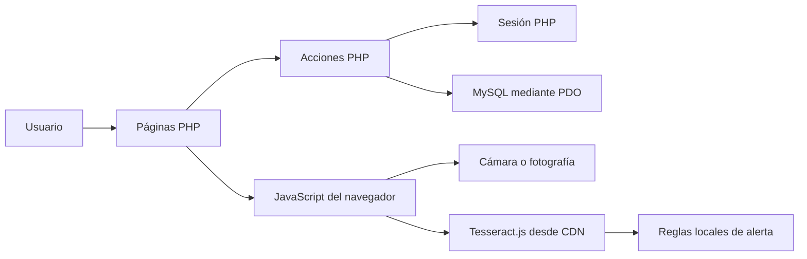

# Documentación técnica de MEDICINESCAN

## 1. Descripción general

MEDICINESCAN es un MVP académico para consultar, de manera demostrativa, si el nombre de un medicamento coincide con las alergias registradas por un usuario.

La aplicación permite:

- Crear una cuenta e iniciar sesión.
- Consultar, editar y eliminar el perfil.
- Encender la cámara o cargar una fotografía.
- Extraer texto de la imagen mediante OCR con Tesseract.js.
- Reconocer cinco nombres de medicamentos.
- Mostrar una alerta visual según la edad y las alergias guardadas.

> **Advertencia:** MEDICINESCAN no determina clínicamente si un medicamento es seguro. No considera dosis, enfermedades, embarazo, interacciones, presentación, historial médico ni otros factores indispensables. El resultado es únicamente una demostración académica.

## 2. Tecnologías utilizadas

| Tecnología | Función |
| --- | --- |
| PHP | Renderiza las páginas, procesa formularios, administra sesiones y consulta MySQL. |
| MySQL | Guarda usuarios y el catálogo inicial de medicamentos. |
| PDO | Conecta PHP con MySQL y ejecuta consultas preparadas. |
| HTML | Define la estructura de las pantallas y formularios. |
| CSS | Implementa el diseño adaptable para escritorio y dispositivos móviles. |
| JavaScript | Controla las pestañas de acceso, la cámara, la carga de imágenes, el OCR y las alertas. |
| Tesseract.js 5 | Extrae texto de las capturas directamente en el navegador. |
| MediaDevices API | Solicita acceso a la cámara mediante `getUserMedia()`. |
| XAMPP | Entorno local recomendado para Apache, PHP, MySQL y phpMyAdmin. |

No se utiliza un framework PHP ni un sistema de construcción de frontend. Tampoco hay una API separada: las páginas y acciones PHP forman una aplicación web tradicional.

## 3. Arquitectura

La aplicación se divide en cuatro capas sencillas:

1. **Presentación:** páginas PHP, HTML y archivos CSS.
2. **Comportamiento en el navegador:** archivos JavaScript y Tesseract.js.
3. **Lógica del servidor:** acciones PHP, sesión, validación y autenticación.
4. **Persistencia:** base de datos MySQL accedida con PDO.



El OCR y la clasificación se ejecutan en el navegador. La imagen capturada no se envía al servidor del proyecto ni se almacena en la base de datos.

## 4. Estructura del proyecto

```text
MEDICINESCAN/
├── actions/
│   ├── delete_profile.php
│   ├── login.php
│   ├── logout.php
│   ├── register.php
│   └── update_profile.php
├── assets/
│   ├── css/
│   │   ├── app.css
│   │   └── auth.css
│   └── js/
│       ├── auth.js
│       └── camera.js
├── config/
│   └── database.php
├── database/
│   └── medicinescan.sql
├── docs/
│   ├── DOCUMENTACION_TECNICA.md
│   └── PLAN_DEL_PROYECTO.md
├── includes/
│   ├── auth.php
│   ├── footer.php
│   ├── header.php
│   └── session.php
├── camera.php
├── home.php
├── index.php
├── profile.php
└── README.md
```

## 5. Función de cada carpeta

### `actions/`

Contiene los controladores PHP que reciben formularios y modifican el estado de la aplicación. Estos archivos no presentan una pantalla propia: validan la solicitud, consultan o actualizan MySQL, guardan un mensaje temporal y redirigen al usuario.

### `assets/`

Agrupa los recursos estáticos que usa el navegador:

- `css/`: apariencia visual de las pantallas.
- `js/`: interacción de formularios, cámara, OCR y resultados.

### `config/`

Contiene la configuración de infraestructura. Actualmente solo incluye la conexión PDO a MySQL.

### `database/`

Contiene el script SQL necesario para crear la base de datos, sus tablas y los registros iniciales.

### `docs/`

Guarda la documentación funcional, técnica y de planificación del proyecto.

### `includes/`

Contiene fragmentos PHP reutilizables:

- Inicio y utilidades de sesión.
- Protección de páginas privadas.
- Encabezado y navegación.
- Pie de página.

## 6. Función de cada archivo

### Archivos de la raíz

#### `index.php`

Es la puerta de entrada pública.

- Inicia la sesión mediante `includes/session.php`.
- Si el usuario ya está autenticado, lo redirige a `home.php`.
- Recupera y muestra mensajes temporales de éxito o error.
- Presenta los formularios de inicio de sesión y registro.
- Genera un token CSRF oculto para cada formulario.
- Carga `assets/css/auth.css` y `assets/js/auth.js`.

El formulario de acceso envía sus datos a `actions/login.php`. El formulario de registro los envía a `actions/register.php`.

#### `home.php`

Es la página principal privada.

- Exige una sesión válida mediante `includes/auth.php`.
- Se conecta a MySQL mediante `config/database.php`.
- Consulta nombre, edad, sexo y alergias del usuario autenticado.
- Muestra un resumen del perfil.
- Ofrece acceso a `camera.php` y `profile.php`.
- Enumera los cinco medicamentos reconocidos por el prototipo.
- Utiliza el encabezado y pie compartidos.

#### `camera.php`

Es la pantalla del escáner.

- Exige autenticación.
- Consulta la edad y las alergias del usuario.
- Inserta esos datos como atributos `data-age` y `data-allergies` del contenedor del escáner.
- Define el elemento `<video>` para la cámara y un `<canvas>` para las capturas.
- Ofrece tres métodos de prueba: cámara, archivo de imagen y texto manual.
- Carga Tesseract.js 5 desde jsDelivr.
- Carga `assets/js/camera.js`, que realiza el reconocimiento y la clasificación.

La interfaz llamada “AR” es una tarjeta superpuesta al video. No realiza seguimiento espacial ni reconocimiento tridimensional.

#### `profile.php`

Es la pantalla de consulta y mantenimiento del perfil.

- Exige autenticación.
- Consulta todos los datos editables del usuario.
- Permite cambiar nombre, usuario, correo, edad, sexo, alergias y, opcionalmente, contraseña.
- Envía las actualizaciones a `actions/update_profile.php`.
- Permite eliminar la cuenta mediante `actions/delete_profile.php`.
- Solicita confirmación en el navegador antes de enviar la eliminación.

#### `README.md`

Es la introducción rápida al repositorio.

- Resume las funciones del MVP.
- Explica la instalación básica en XAMPP.
- Indica la configuración predeterminada de MySQL.
- Advierte sobre las limitaciones médicas del prototipo.
- Enlaza la documentación más extensa.

### Carpeta `actions/`

#### `actions/login.php`

Procesa el inicio de sesión.

1. Acepta únicamente solicitudes `POST` con token CSRF válido.
2. Busca una cuenta cuyo usuario o correo coincida con el valor recibido.
3. Compara la contraseña con el hash almacenado usando `password_verify()`.
4. Regenera el identificador de sesión.
5. Guarda `user_id`, `full_name` y `username` en `$_SESSION`.
6. Redirige a `home.php`.

Si las credenciales son incorrectas, regresa a `index.php` con un mensaje de error.

#### `actions/register.php`

Procesa la creación de una cuenta.

- Requiere `POST` y token CSRF válido.
- Valida el correo.
- Exige nombre completo.
- Permite nombres de usuario de 3 a 30 caracteres formados por letras, números, punto, guion o guion bajo.
- Exige una contraseña de al menos 6 caracteres.
- Valida una edad entre 1 y 120.
- Limita el sexo a los valores permitidos.
- Comprueba que correo y usuario no estén registrados.
- Protege la contraseña con `password_hash()`.
- Inserta el usuario en MySQL.

Después del registro no inicia sesión automáticamente; redirige al formulario de acceso.

#### `actions/logout.php`

Cierra la sesión.

- Vacía `$_SESSION`.
- Destruye la sesión existente.
- Inicia una nueva sesión para guardar el mensaje de confirmación.
- Redirige a `index.php`.

El cierre se activa con un enlace `GET`, no con un formulario `POST`.

#### `actions/update_profile.php`

Actualiza la cuenta autenticada.

- Comprueba sesión, método `POST` y token CSRF.
- Aplica validaciones equivalentes a las del registro.
- Verifica que el nuevo correo o usuario no pertenezcan a otra cuenta.
- Actualiza los datos con una consulta preparada.
- Solo reemplaza la contraseña cuando el campo no está vacío.
- Actualiza en sesión el nombre completo y nombre de usuario.
- Redirige a `profile.php` con un mensaje.

#### `actions/delete_profile.php`

Elimina la cuenta autenticada.

- Comprueba sesión, método `POST` y token CSRF.
- Borra de `users` el registro correspondiente a `$_SESSION['user_id']`.
- Destruye la sesión.
- Crea una sesión nueva para mostrar el mensaje de confirmación.
- Redirige a `index.php`.

### Carpeta `assets/js/`

#### `assets/js/auth.js`

Controla las pestañas de acceso.

- Alterna entre los formularios de inicio de sesión y registro.
- Cambia la clase visual `active` de los botones.
- Deshabilita los campos del formulario oculto para que no participen en validaciones o envíos.
- Lee `?form=signup` para abrir directamente el registro después de una validación fallida.

#### `assets/js/camera.js`

Implementa el escáner en el navegador.

Sus responsabilidades son:

- Obtener referencias a los elementos de la pantalla.
- Solicitar la cámara trasera, cuando está disponible.
- Dibujar un fotograma del video en el `<canvas>`.
- Cargar una fotografía local en ese mismo `<canvas>`.
- Ejecutar `Tesseract.recognize()` con idioma español.
- Mostrar el progreso del OCR.
- Normalizar texto a minúsculas y sin acentos.
- Buscar uno de estos nombres:
  - Omeprazol
  - Paracetamol
  - Aspirina
  - Olanzapina
  - Ibuprofeno
- Comparar el medicamento reconocido con las alergias del perfil.
- Aplicar una precaución adicional para aspirina cuando la edad es menor de 18 años.
- Mostrar una tarjeta verde, amarilla o roja.
- Detener las pistas de la cámara al abandonar la página.

Las reglas actuales son:

| Condición | Resultado visual |
| --- | --- |
| El medicamento coincide con una alergia, alias de aspirina o alergia a AINEs | Rojo: alerta |
| Es aspirina y el usuario tiene menos de 18 años | Amarillo: precaución |
| No coincide con las reglas anteriores | Verde: sin coincidencia en las alergias registradas |
| No se reconoce un medicamento permitido o falla el OCR | Amarillo: no identificado |

El color verde no significa que el medicamento sea clínicamente seguro; únicamente indica que no coincidió con las reglas locales del prototipo.

### Carpeta `assets/css/`

#### `assets/css/auth.css`

Define el diseño exclusivo de `index.php`.

- Fondo degradado.
- Tarjeta de autenticación.
- Pestañas de acceso y registro.
- Formularios, estados de foco, botones y alertas.
- Adaptación a pantallas menores de 520 píxeles.
- Importa las fuentes Roboto y Oswald desde Google Fonts.

#### `assets/css/app.css`

Define el diseño de las páginas privadas.

- Variables de colores globales.
- Barra de navegación.
- Hero de inicio.
- Resumen del perfil y tarjetas de medicamentos.
- Formularios del perfil.
- Área del escáner, marco de enfoque y tarjeta superpuesta.
- Estados seguro, precaución y peligro.
- Botones, alertas, panel de prueba y aviso legal.
- Diseño adaptable mediante puntos de corte de 850 y 650 píxeles.
- Importa la fuente Inter desde Google Fonts.

### Carpeta `config/`

#### `config/database.php`

Crea la conexión PDO disponible en la variable `$pdo`.

Configuración predeterminada:

| Parámetro | Valor |
| --- | --- |
| Servidor | `localhost` |
| Base de datos | `medicinescan` |
| Usuario | `root` |
| Contraseña | vacía |
| Codificación | `utf8mb4` |

PDO está configurado para:

- Lanzar excepciones ante errores.
- Devolver resultados como arreglos asociativos.

Si la conexión falla, el proceso termina con un mensaje que solicita importar el script SQL.

### Carpeta `database/`

#### `database/medicinescan.sql`

Crea la base `medicinescan` con codificación `utf8mb4` y dos tablas.

**Tabla `users`**

| Campo | Uso |
| --- | --- |
| `id` | Identificador autonumérico. |
| `email` | Correo único. |
| `full_name` | Nombre completo. |
| `username` | Nombre de usuario único. |
| `password` | Hash de la contraseña. |
| `age` | Edad entre 1 y 120, validada por PHP. |
| `sex` | Valor enumerado permitido. |
| `allergies` | Texto libre con alergias. |
| `created_at` | Fecha de creación. |
| `updated_at` | Fecha de última actualización automática. |

**Tabla `medicines`**

| Campo | Uso previsto |
| --- | --- |
| `id` | Identificador autonumérico. |
| `name` | Nombre único del medicamento. |
| `aliases` | Nombres alternativos separados como texto. |
| `general_warning` | Advertencia general. |

El script inserta Omeprazol, Paracetamol, Aspirina, Olanzapina e Ibuprofeno. Sin embargo, la versión actual no consulta esta tabla: los cinco nombres y las reglas están escritos directamente en `camera.js`.

### Carpeta `includes/`

#### `includes/session.php`

Centraliza las utilidades de sesión.

- Inicia la sesión si todavía no existe.
- `createCsrfToken()`: genera y conserva un token aleatorio de 32 bytes.
- `validCsrfToken()`: compara el token recibido mediante `hash_equals()`.
- `setMessage()`: guarda un mensaje temporal en sesión.
- `getMessage()`: devuelve el mensaje y lo elimina para que aparezca una sola vez.

#### `includes/auth.php`

Protege las páginas privadas.

- Carga `session.php`.
- Comprueba `$_SESSION['user_id']`.
- Si no existe, guarda un mensaje y redirige a `index.php`.

Lo utilizan `home.php`, `camera.php` y `profile.php`.

#### `includes/header.php`

Genera el inicio del documento HTML compartido.

- Carga la sesión.
- Construye el título de la página.
- Carga `assets/css/app.css`.
- Presenta la marca y la navegación.
- Marca como seleccionado el enlace de la página actual.
- Abre el elemento `<main>`.
- Recupera y muestra mensajes temporales.

La variable `$pageTitle` debe definirse antes de incluirlo.

#### `includes/footer.php`

Completa el documento iniciado por `header.php`.

- Cierra `<main>`.
- Muestra el aviso académico.
- Cierra `<body>` y `<html>`.

### Carpeta `docs/`

#### `docs/PLAN_DEL_PROYECTO.md`

Describe el objetivo del primer avance, la estructura inicial, el CRUD, una distribución sugerida de tareas, el alcance del OCR y posibles mejoras. También plantea una segunda etapa con Ionic y Angular.

#### `docs/DOCUMENTACION_TECNICA.md`

Es este documento. Explica la arquitectura, instalación, flujos, base de datos y responsabilidad de cada elemento del repositorio.

## 7. Flujos principales

### Registro

```text
index.php
  → formulario de registro
  → actions/register.php
  → validaciones y búsqueda de duplicados
  → password_hash()
  → INSERT en users
  → mensaje temporal
  → index.php
```

### Inicio de sesión

```text
index.php
  → actions/login.php
  → búsqueda por usuario o correo
  → password_verify()
  → creación de sesión
  → home.php
```

### Consulta y actualización del perfil

```text
profile.php
  → SELECT del usuario
  → formulario de edición
  → actions/update_profile.php
  → validación y UPDATE
  → profile.php
```

### Eliminación de cuenta

```text
profile.php
  → confirmación del navegador
  → actions/delete_profile.php
  → DELETE en users
  → destrucción de sesión
  → index.php
```

### Escaneo

```text
camera.php
  → cámara, fotografía o texto manual
  → canvas
  → Tesseract.js
  → texto normalizado
  → búsqueda del nombre
  → comparación con edad y alergias
  → tarjeta visual
```

## 8. Instalación y ejecución

### Requisitos

- XAMPP con Apache, PHP y MySQL.
- Navegador moderno con JavaScript.
- Conexión a internet para descargar Tesseract.js y las fuentes externas.
- Cámara opcional; también se puede cargar una fotografía o usar la prueba manual.

### Pasos

1. Copiar la carpeta `MEDICINESCAN` dentro de `C:\xampp\htdocs\`.
2. Iniciar Apache y MySQL desde XAMPP.
3. Abrir `http://localhost/phpmyadmin`.
4. Importar `database/medicinescan.sql`.
5. Revisar `config/database.php` si MySQL no usa las credenciales predeterminadas.
6. Abrir `http://localhost/MEDICINESCAN/`.
7. Crear una cuenta, iniciar sesión y probar el escáner.

El acceso a cámara normalmente funciona en `localhost`, ya que el navegador lo considera un contexto seguro para desarrollo.

## 9. Seguridad implementada

- Contraseñas almacenadas con `password_hash()`.
- Verificación mediante `password_verify()`.
- Consultas preparadas con PDO.
- Tokens CSRF en formularios que cambian datos.
- Regeneración del ID al iniciar sesión.
- Escape con `htmlspecialchars()` al mostrar datos del usuario.
- Protección de páginas privadas mediante sesión.
- Validación de correo, edad, sexo, usuario y longitud mínima de contraseña.
- Restricciones únicas para correo y usuario en MySQL.

## 10. Limitaciones actuales

- El resultado no es una evaluación médica.
- Las alergias se guardan como texto libre y se comparan mediante coincidencias simples.
- La tabla `medicines` no participa en el escaneo.
- Los nombres y reglas están codificados en `camera.js`.
- Solo se reconocen cinco medicamentos.
- No se guarda historial de escaneos.
- No hay roles de usuario ni panel administrativo.
- No existe recuperación de contraseña.
- No hay verificación de correo.
- El cierre de sesión se activa mediante `GET`.
- Las credenciales de base de datos están escritas directamente en el archivo de configuración.
- Tesseract.js, sus datos de idioma y las fuentes dependen de servicios externos.
- La calidad del OCR depende de luz, enfoque, orientación, tipografía y resolución.
- La interfaz AR es únicamente una superposición visual.

## 11. Lugares habituales para hacer cambios

| Cambio deseado | Archivo principal |
| --- | --- |
| Agregar campos al perfil | `database/medicinescan.sql`, formularios PHP y acciones de registro/actualización |
| Cambiar credenciales MySQL | `config/database.php` |
| Agregar medicamentos reconocidos | `assets/js/camera.js` |
| Cambiar reglas de alerta | `assets/js/camera.js` |
| Modificar la pantalla de acceso | `index.php` y `assets/css/auth.css` |
| Modificar navegación o estructura compartida | `includes/header.php` y `includes/footer.php` |
| Cambiar la pantalla principal | `home.php` |
| Cambiar la pantalla del escáner | `camera.php` y `assets/css/app.css` |
| Cambiar validaciones del usuario | `actions/register.php` y `actions/update_profile.php` |
| Modificar el esquema inicial | `database/medicinescan.sql` |

## 12. Evolución recomendada

Para que el proyecto crezca sin duplicar reglas, conviene:

1. Consultar medicamentos y alias desde MySQL a través de un endpoint PHP.
2. Modelar alergias en una tabla relacionada, en lugar de texto libre.
3. Añadir historial de escaneos con fecha, texto detectado y resultado.
4. Mover credenciales a variables de entorno.
5. Implementar cierre de sesión por `POST`.
6. Añadir pruebas automatizadas para validaciones y clasificación.
7. Incorporar información farmacológica validada y revisión profesional.
8. Convertir el backend PHP en API JSON si se desarrolla el cliente Ionic/Angular.

